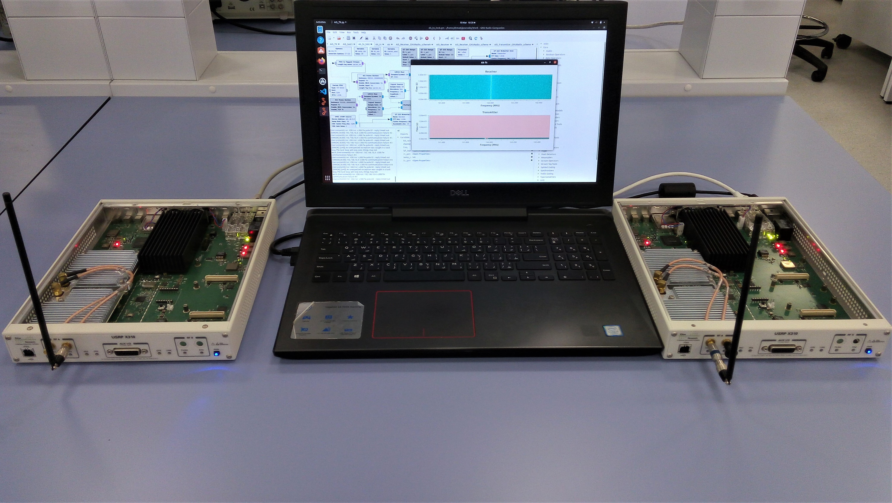
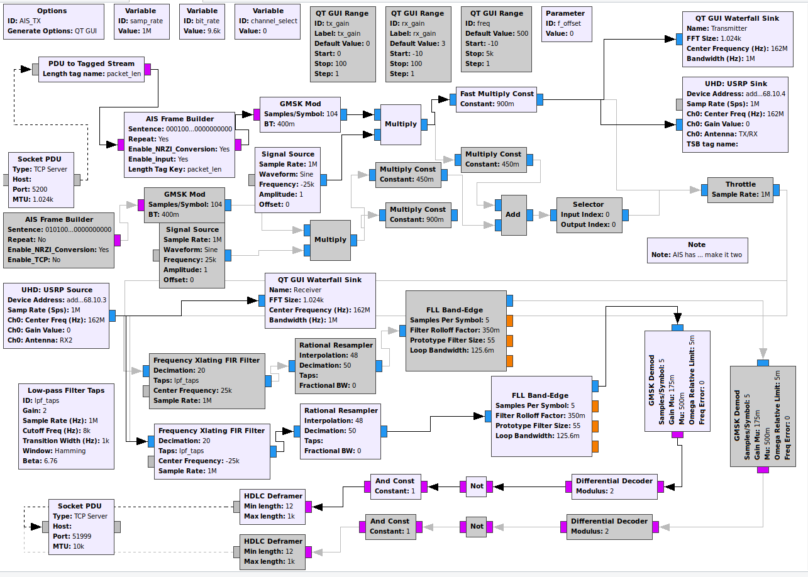

# Auth-AIS: Secure, Flexible, and Backward-Compatible Authentication of Vessels AIS Broadcasts (Proof of Concept)
Auth-AIS is a Broadcast Authentication protocol specifically designed to meet the features and bandwidth constraints of the Automatic Identification System (AIS) communication technology. It has been designed as a standard-compliant AIS application, that can be installed by Class-A and Class-B AIS transceivers to establish broadcast authentication with neighboring entities, being them either vessels or port authorities. 

A Proof of Concept using GNURadio and Ettus Research X310 SDRs on how to set up broadcast authentication between two AIS transceivers. It supports different security levels: <i>1, 2, 3, 4, 5 </i> and <i>6</i> that can support different scenarios that a maritime vessel could require.

<p align="center">
     
</p>

<i>For further details, please refer to the paper.</i>

# Demo
A small demo showing Auth-AIS in rejecting impersonation and replay attacks. For details see the demo folder

<div style="text-align:center"> 
<a href="http://www.youtube.com/watch?feature=player_embedded&v=cnn8EZb4ksI
" target="_blank"></a>
</div>

# Why create this?
Usage of AIS is increasing rapidly, yet literature on it is scarce. The available literature, provides contribution on it that is not standard compliant or could be done just using a simple software update. Thus, our contribution is to raise awareness about this and provide a solution that is standard compliant and backwards compatible.

# How to use
This project has two parts, two C++ programs and a flowgraph in GNURadio. To set them up: </br>
1) Install <i>gnuradio</i> software <br />
2) Install <i>gr-aistx_with_input</i> block to gnuradio (instructions inside the block folder on how to compile and install it). If you are using PyBOMBS, please initialize your environment first. <br />
3) Open <i>ais_transceiever.grc</i> flowgraph in GNURadio.  <br />
4) Make sure ports <b>51999</b> and <b>5200</b> are not adopted by any network protocol. <br />
5) Execute recvr or compile receiver.cpp code from the source to start the receiver.<br />
6) Execute main or compile main.cpp code from the source to start the transmitter.<br />

<p align="center">
     
</p>

# How to compile code
To compile from source or use a different security level for main.cpp, go to src folder and use the following command:
```
    g++ -O2 -DSECURITY_LEVEL=1 main.cpp BloomFilter.cpp smhasher-master/src/MurmurHash3.cpp core-master/cpp/core.a ./ais_receiver/*.c -o main
```

To compile from source for receiver.cpp, go to src folder and use the following command:
```
    g++ -O2 receiver.cpp ais_receiver/*.c core-master/cpp/core.a BloomFilter.cpp smhasher-master/src/MurmurHash3.cpp -o recvr
```
## Security Level and other Flags
In order to set a different security level, you can add flag <i>-DSECURITY_LEVEL=<b>t</b></i> that ranges from 0 to 6. Following table provides information about the different security levels.

<table>
  <tr>
    <th style="text-align:center"><b>Security Level</b></th>
    <th><i><b>Description</b></i></th>
  </tr>
  <tr>
    <td style="text-align:center">0</td>
     <td>No Security. AIS communications are still performed in clear-text, without any authentication service.</td>
  </tr>
  <tr>
    <td style="text-align:center">1</td>
    <td>Deterministic Security Configuration, Digest Size of 49 bytes, key size of 16 bytes, sent out for every AIS message (overhead=75%)</td>
  </tr>
  <tr>
    <td style="text-align:center">2</td>
    <td>Deterministic Security Configuration, Digest Size of 21 bytes, key size of 16 bytes, sent out for every AIS message (overhead=66.67%)</td>
  </tr>
  <tr>
    <td style="text-align:center">3</td>
    <td>Probabilistic Security Configuration, Option 1, BloomFilter size of 17 bytes, digest Size of 32 bytes, keysize of 16 bytes, sent out for every N=2 AIS messages (overhead=60%)</td>
  </tr>
    <tr>
    <td style="text-align:center">4</td>
    <td>Probabilistic Security Configuration, Option 1, BloomFilter size of 29 bytes, digest Size of 20 bytes, keysize of 16 bytes, sent out for every N=4 AIS messages (overhead=42.86%)</td>
  </tr>
    <tr>
    <td style="text-align:center">5</td>
    <td>Probabilistic Security Configuration, Option  2, BloomFilter size of 65 bytes, digest Size of 20 bytes, and key size of 16 bytes, sent out every N= 9 AIS messages (overhead=35.71%)</td>
  </tr>
    <tr>
    <td style="text-align:center">6</td>
    <td>Probabilistic Security Configuration, Option  2, BloomFilter size of 65 bytes, digest Size of 49 bytes, and key size of 16 bytes, sent out every N=9 AIS messages (overhead=40%);</td>
  </tr>
</table>

Other flags include: <br />
    -DPORT_SEND or -DPORT_RECEIVE to set another port for send/receive sockets <br />

# Contributing
Pull requests are welcome. For major changes, please open an issue first to discuss what you would like to change.

# Developers
- Ahmed Aziz             (<aaziz@mail.hbku.edu.qa>)<br />
- Pietro Tedeschi        (<ptedeschi@mail.hbku.edu.qa>)<br />
- Savio Sciancalepore    (<ssciancalepore@hbku.edu.qa>)<br />
- Roberto Di Pietro      (<rdipietro@hbku.edu.qa>)<br />
Division of Information and Computing Technology (ICT), College of Science and Engineering (CSE)<br />Hamad Bin Khalifa University (HBKU), Doha, Qatar<br />

# Credits
Credits go to the original authors of TESLA protocol, MIRACL Core Crypto library, gr_aistx and ais_receiver whose original efforts made this possible:
<br />
https://github.com/miracl/core  <br />
https://github.com/trendmicro/ais   <br />
https://github.com/juan0fran/ais_rx <br />

## License
Auth-AIS is released under the BSD 3-Clause <a href="LICENSE">license</a>.
